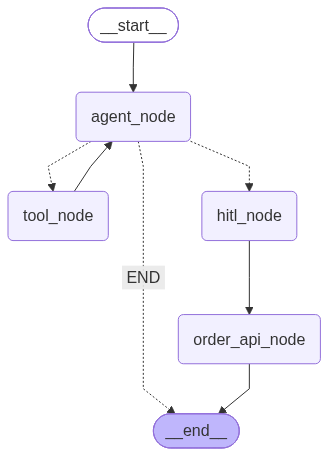

# Boba Tea AI

An interactive boba tea ordering assistant built with LangGraph and OpenAI.

## What it does

- Chats with users to browse the boba tea menu
- Helps place orders by product, size, and quantity
- Uses human-in-the-loop approval before confirming an order
- Persists orders in a local SQLite database

## Tech stack

- Python 3.12+
- LangGraph + LangChain
- OpenAI GPT
- SQLite
- Rich CLI

## Run locally

1. Install dependencies:

   ```bash
   uv sync
   ```

2. Create a `.env` file with your OpenAI API key:

   ```env
   OPENAI_API_KEY=your-key-here
   ```

3. Start the assistant:

   ```bash
   uv run main.py
   ```

4. Type your order or ask about the menu. Approve or reject the order when prompted.

Type `exit` or `quit` at any prompt to leave.

## Agent graph



The assistant uses a LangGraph state machine that flows from `agent_node` through tool calls, human-in-the-loop approval, and order persistence before ending the turn.

## Project structure

- `main.py` — interactive entry point
- `app/graph.py` — LangGraph state machine
- `app/nodes.py` — agent, tool, HITL, and order API nodes
- `app/database.py` — SQLite database setup and helpers
- `app/schema.py` — Pydantic models for products, orders, and responses
- `app/state.py` — graph state definition
- `app/prompts.py` — system prompt
